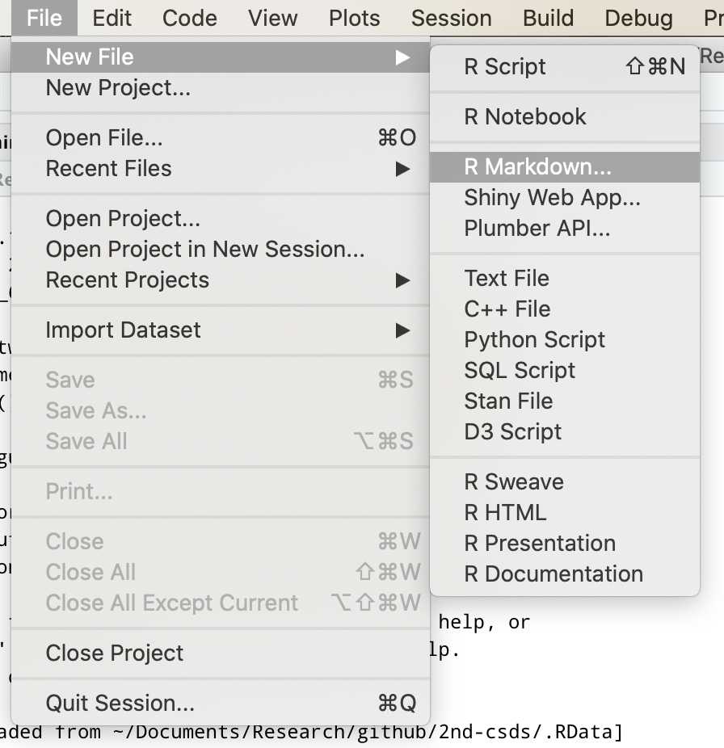

```{r setup, include=FALSE}
knitr::opts_chunk$set(cache=TRUE)
```

# Who am I?

## Who am I?

- Marcus Nunes, Assistant Professor at Federal University of Rio Grande do Norte

- PhD in Statistics from Penn State

- Data science, machine learning, r programming, statistics education

- Director of Laboratório de Estatística Aplicada: [lea.estatistica.ccet.ufrn.br/](http://lea.estatistica.ccet.ufrn.br/)

- Personal website: [marcusnunes.me](https://marcusnunes.me/)

- Short course material: [github.com/mnunes/2nd-csds](https://github.com/mnunes/2nd-csds/)


# What is RMarkdown?

## What is RMarkdown?

- R Markdown is a file format for making dynamic reports

- You put together markdown (a lightweight markup language) and R (a programming) language to build beautiful reports

- Advanced users can add LaTeX in the mix and make even more sophisticated texts


## What is RMarkdown?

- **Word:** What You See Is What You Get (WYSIWYG)

- **R Markdown**: markup language, like LaTeX and HTML

- Focus on the content, not the design


# Why RMarkdown?

## Why RMarkdown?

- **Reproducibility:** using the same data and code to get the same conclusions

- **Replicability:** doing the experiment twice to get the same result

## Why RMarkdown?

- Ease of use

- Short learning curve when compared to other markup languages

- Makes documentantion simpler

- Collaborative tool

- Long run time saver


# Typical Problems without R Markdown

## Typical Problems without R Markdown

- Data scattered in different folders

- Many versions of the same dataset

- Missing steps in the code

- Go to statistical software, run the analysis, export the figures, insert them in the paper, they do not look good, remove, go back to statistical software, change the figures, export tem again, insert them in the paper, they still do not look good, rinse and reapeat until exhaustion


## Typical ~~Problems without~~ Solutions with R Markdown

- Code and data are in the same parent folder (usually)

- The dataset is processed everytime you run your code

- The code must be complete; otherwise, the report is not generated

- Run the analysis and report at the same time, so everything is always in sync


# Syntax

## Syntax

Every R Markdown document has three parts: 

1. Header: document definitions

2. Chunks: snippets with R code 

3. Text: analysis explanation

## Syntax

- The best way to start working with R Markdown is by practicing

- Open the file `examples/report.Rmd`

- Let's work on it together, figuring out what can be done in this language


# Other Styles

## Other Styles

- Like in LaTeX, it is very easy to change the look and feel of our documents

- You can check what styles are available in your computer in the menu `File > New File > R Markdown...`

## Other Styles




# Practice

## Practice

- Now it is time to practice what we learned today

- Open the file `practice/practice.Rmd` and follow the instructions

- Notice the solutions are in `practice/solutions.Rmd`, but avoid to look at them and try to figure out the solutions by yourself

- Raise your hand or call my name if you have any questions


